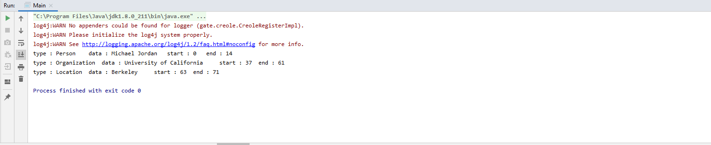

# Gate Embedded with Annie based plugin Example 

Flow 
* initialize gate 
* use .gape file from annie plugin which is loaded through maven. 
* annieController
* load corpus
* get annotation 

Build and run Main.java

Screenshot:
